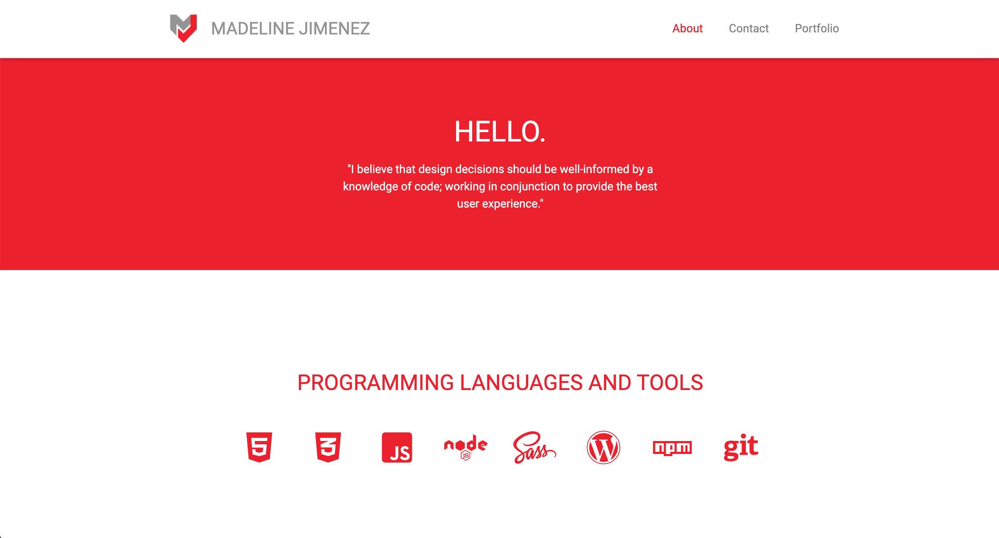

# bootcamp_updated_portfolio

## Screenshot of Portfolio

## Live Link
- View my website [here](https://mijimenez.github.io/bootcamp_updated_portfolio/)

## Technologies Used
- HTML5
- CSS3
- Sass (CSS pre-processor)
- Bootstrap

## About
- Full-Stack development portfolio website that includes my:
    - brand identity
    - preferred programming languages and tools
    - bio
    - contact information
    - top portfolio pieces with live links and GitHub repo links

- - -
© 2019 [Madeline Jimenez](https://github.com/mijimenez)